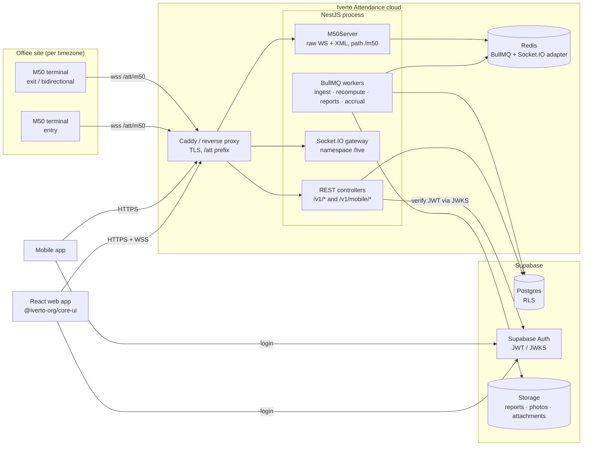
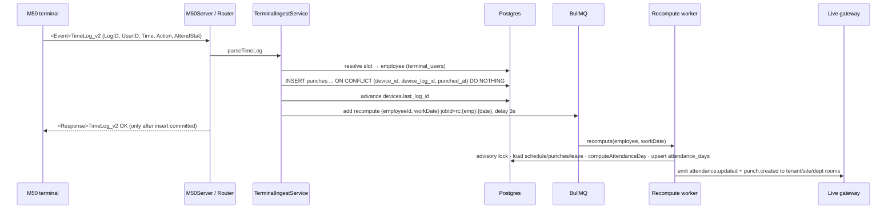
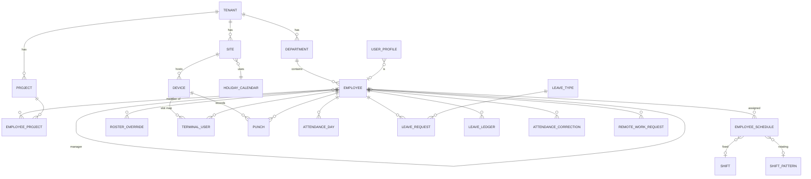

# Iverto Attendance — Architecture & Implementation Plan

Face-recognition workforce attendance built on the **M50 biometric terminal**.
NestJS API · React web app · mobile API surface · Supabase (Postgres, Auth, Storage).

Companion docs in this folder:
- [`m50-terminal-integration.md`](./m50-terminal-integration.md) — hard-won terminal caveats. **Read before touching the terminal code.**
- [`websocket_sdk_protocol.txt`](./websocket_sdk_protocol.txt) — vendor SDK protocol.

Reference implementation: `iverto-hostel_usecase/iverto-cl-backend/cloud` ("the hostel backend" below). Its
terminal stack is production-proven and is **copied, not rewritten**.

---

## 0. Decisions at a glance

| # | Decision | Why |
|---|---|---|
| D1 | **One NestJS app (modular monolith)**, run as one process to start | Terminal sockets are pinned to the process they dialled (hostel doc, *Single instance*). One process sidesteps that until scale forces the split in §2.3. |
| D2 | **Copy the hostel `terminals/` module wholesale**, then adapt | Position-vs-LogID backfill, slot allocation, upgrade-reaping, UTF-16 names, clock-`Z` lie — all already solved and tested. |
| D3 | **Prisma on Supabase Postgres**, RLS via `set_config` GUCs (hostel pattern) | Proven; typed; RLS is defense in depth behind app-level scoping. |
| D4 | **Attendance is recomputed, never incremented.** `AttendanceDay = f(schedule, punches, leave, holidays, policy)` | Idempotent; backfill, late punches, leave approvals and corrections all become "recompute that day". Removes the need for the hostel's `SubjectPresence` race guard. |
| D5 | **Raw punches are immutable.** Corrections are new punches with `source = CORRECTION` | Audit-ready by construction. |
| D6 | **Roster is materialised** into `attendance_days` rows ahead of time | Lets a minute-sweeper flip "not yet in" → "absent" without any event, and freezes the schedule a day was judged against. |
| D7 | **All times stored as `timestamptz` (UTC); `work_date` is a local `date`; timezone lives on Site (and per device clock)** | Multi-timezone and night shifts without date math in reports. |
| D8 | **Socket.IO for live monitoring** (not Supabase Realtime) | Hostel RLS uses custom GUCs, not `auth.jwt()`, so Realtime policies would be a second RLS system. Socket.IO + rooms is already in the hostel code. |
| D9 | **All exports (CSV & PDF) are generated server-side as BullMQ jobs** | See §11. `@iverto-org/core-ui` is the design system (components, tokens, charts) — it has **no PDF/CSV exporter**. The PDF templates reuse its `styles.css` + bundled Poppins so reports look like the app. |
| D10 | **BullMQ repeatable jobs for every schedule** (no `@nestjs/schedule` crons) | Runs exactly once across replicas once the API scales out. |
| D11 | **Web types generated from Swagger** (`openapi-typescript`) — no shared package | One source of truth, zero hand-maintained DTO copies. |

---

## 1. Feature → system map

| Feature | Stored in | Computed by | Web page | API |
|---|---|---|---|---|
| Daily Attendance Status | `attendance_days` | Attendance engine (§6) | `/attendance/daily` | `GET /v1/attendance/days` |
| Daily Logs | `punches` | Terminal ingest (§5) | `/attendance/logs` | `GET /v1/punches` |
| Attendance Overview | `attendance_days` (month) | SQL aggregates | `/attendance/overview` | `GET /v1/attendance/overview` |
| Leave Applications & Balance | `leave_requests`, `leave_ledger` | Leave service (§8) | `/leave/*` | `/v1/leave/*`, `/v1/mobile/leave/*` |
| Detailed In/Out time | `punches` + `attendance_days.first_in/last_out/segments` | Engine pairing (§6.4) | day drawer on every attendance table | `GET /v1/attendance/days/:id` |
| Real-time Monitoring | `attendance_days.live_state` | Engine + minute sweeper | `/live` | `GET /v1/live/board` + Socket.IO `/live` |
| Shift & Schedule Planning | `shifts`, `shift_patterns`, `employee_schedules`, `roster_overrides`, `holidays` | Schedule resolver (§7) | `/schedule/*` | `/v1/shifts`, `/v1/roster` |
| Automated Reporting | `report_jobs`, `report_schedules`, Storage bucket `reports` | Report worker (§11) | `/reports` | `/v1/reports/*` |

Supporting (required for the above to be correct, kept minimal):
**attendance corrections** (missed punches — without it "absent" is unfixable), **remote work requests**
(feeds the *working remotely* live state), **terminal & face enrolment** (copied from hostel).

---

## 2. System architecture

### 2.1 Context



### 2.2 Process layout (phase 1)

One Node process, one Redis, Supabase managed. Everything below lives in `apps/api`:

- HTTP (Fastify adapter, as hostel) serving REST + Swagger (non-prod).
- `M50Server` attached to the same HTTP server on `M50_WS_PATH` — keep `SharedHttpIoAdapter` (`destroyUpgrade: false`) exactly as the hostel does, or terminals get reaped under load.
- Socket.IO `/live` namespace with the Redis adapter (costs nothing now, required later).
- BullMQ workers in-process.

### 2.3 Scaling seam (do **not** build now)

When one API replica is not enough, run the same image in two roles via `APP_ROLE`:

| Role | Replicas | Owns |
|---|---|---|
| `edge` | exactly 1 (or 1 per terminal shard) | `M50Server`, `TerminalSessionRegistry`, `terminal-command` worker |
| `api` | N | REST, Socket.IO, all other workers |

Server→terminal commands (enrol, sync, device/logs) then travel as a BullMQ `terminal-command` job that the
`edge` role executes and the `api` awaits with `job.waitUntilFinished()`. Until then, every device command goes
through `TerminalSessionRegistry.require()` directly — that call site is the seam.

### 2.4 Repository layout

```
iverto-att/
├─ package.json               # npm workspaces: apps/*
├─ .npmrc                     # @iverto-org:registry=https://npm.pkg.github.com
├─ docs/
├─ apps/
│  ├─ api/                    # NestJS
│  │  ├─ prisma/
│  │  │  ├─ schema.prisma
│  │  │  ├─ migrations/
│  │  │  └─ post-init/        # RLS, exclusion constraints, views (raw SQL, idempotent)
│  │  ├─ scripts/m50-simulator.ts   # copied from hostel
│  │  └─ src/
│  │     ├─ main.ts
│  │     ├─ app.module.ts
│  │     ├─ common/            # prisma, rls-context, socket-io.adapter, storage, time utils
│  │     ├─ auth/              # JWT guard (JWKS), roles, scope service
│  │     ├─ audit/             # copied
│  │     ├─ org/               # tenants, sites, departments, projects, holidays, settings/branding
│  │     ├─ employees/         # employees, user provisioning, offboarding
│  │     ├─ terminals/         # copied from hostel (§4)
│  │     ├─ punches/           # punch store + punch-ingest worker
│  │     ├─ schedule/          # shifts, patterns, assignments, overrides, resolver, roster materialiser
│  │     ├─ attendance/        # engine (pure), recompute worker, sweeper, corrections, overview
│  │     ├─ leave/             # types, ledger, requests, accrual jobs
│  │     ├─ remote/            # remote-work requests + mobile punches
│  │     ├─ live/              # Socket.IO gateway + board snapshot
│  │     ├─ reports/           # report definitions, CSV writer, PDF renderer, jobs, schedules
│  │     ├─ notifications/     # copied (push + inbox), trimmed
│  │     └─ mobile/            # /v1/mobile/* controllers (thin; call domain services)
│  └─ web/                    # React + Vite
└─ (no packages/ — see D11)
```

Move the root `@iverto-org/core-ui` dependency into `apps/web/package.json`.

---

## 3. Tech stack

| Layer | Choice | Notes |
|---|---|---|
| API | NestJS 11, Fastify adapter, class-validator, Swagger | Same versions as hostel so copied code compiles unchanged. |
| DB access | Prisma 6 + `@prisma/adapter-pg` | `DATABASE_URL` = Supavisor transaction pooler (6543); `DIRECT_URL` = 5432 for migrate. |
| Queues | BullMQ 5 + ioredis | Queues listed in §16. |
| Realtime | `@nestjs/websockets` + socket.io 4 + `@socket.io/redis-adapter` | |
| Terminal | `ws` 8, `fast-xml-parser` 5, `date-fns-tz` 3 | Copied. |
| Auth | Supabase Auth, `jose` JWKS verification | |
| Storage | `@supabase/supabase-js` Storage (private buckets, signed URLs) | |
| PDF | `pdfmake` (pure JS, no browser) + bundled Poppins TTF | Tens of MB per job; fits a 1 GB VM (§11.3). |
| CSV | ~20 lines of own code, streamed | No dependency needed (§11.4). |
| Push | FCM via `firebase-admin` (copied `notifications/`) | Optional; NoOp provider when unset. |
| Web | React 19, Vite, TypeScript, React Router, TanStack Query, `socket.io-client`, `@supabase/supabase-js` (auth only), `@iverto-org/core-ui` | No Redux, no form library, no date-picker library (core-ui `DateInput`). |
| Tests | Jest (api), Vitest (web) | Engine is a pure function → table-driven tests. |

---

## 4. M50 terminal integration

### 4.1 Copy list (from hostel `src/modules/terminals`, `common/`, `scripts/`)

| File | Change needed |
|---|---|
| `protocol/m50-protocol.ts` (+spec) | none |
| `m50-session.ts`, `m50.server.ts` (+specs) | none |
| `services/terminal-session.registry.ts` | none |
| `services/terminal-router.service.ts` | On Login additionally send `SetTime` (§4.3). |
| `services/terminal-registry.service.ts` | Read clock timezone from the device row, not `M50_CLOCK_TZ` (§4.3). |
| `services/terminal-backfill.service.ts` (+spec) | none |
| `services/terminal-ingest.service.ts` | Write to `punches` instead of enqueuing `auth-event-ingest` (§5). `subjectType` becomes `EMPLOYEE`. |
| `services/terminal-enrollment.service.ts`, `terminal-template.service.ts`, `terminal-inspection.service.ts` (+specs) | Rename student → employee; add `UserPeriod` + offboarding (§4.4). |
| `terminals.controller.ts`, `dto/` | Drop `/tenants/:tenantId` prefix (tenant comes from JWT, §13). |
| `common/socket-io.adapter.ts` | none — **mandatory** |
| `scripts/m50-simulator.ts` | none |

Everything else in the hostel app (curfew, permissions/outpass, visitors, WhatsApp, OTA, edge-agent gallery,
bootstrap tokens) is **not** copied.

> ponytail: copy, not a shared package. Extract `@iverto-org/m50` only when a third product needs it or the
> two copies start diverging on bug fixes.

### 4.2 Caveats that carry over unchanged (from `m50-terminal-integration.md`)

- **Provision before connect.** `POST /v1/terminals` with the serial; unknown serials never get a token.
- **Position ≠ LogID.** Backfill binary-searches the resume position. Do not "simplify" it.
- **AttendStat is unreliable.** Direction comes from the terminal's configured `direction` (§4.3); only literal `In`/`Out` overrides.
- **One command in flight per terminal.** Bulk operations fan out across devices, never within one.
- **Slot numbers are identity.** Probe before allocating; reserve the mapping row before writing the device.
- **`RemoteEnroll` does not work on this hardware.** Enrol via photo, or reserve slot → enrol at keypad → capture → replicate, or keypad → claim.
- **Admin logs cannot be re-pulled** — ack only after the audit row commits.
- **Timestamps carry a lying `Z`** — interpreted in the device's clock timezone.
- **Ack a TimeLog only after it is durable** (here: after the `punches` insert commits).

### 4.3 What changes for attendance

**Direction is configured per gate.** Each terminal carries `gate_name` (e.g. "Main lobby", "Warehouse dock") and
`direction ∈ {IN, OUT, BOTH}`, set when it is provisioned and editable on the Terminals page. A gate is simply the
terminals sharing a `gate_name` at a site, so each gate independently chooses its setup:

| Gate setup | Terminals | Punches stored as | Engine treatment (§6.4) |
|---|---|---|---|
| Single bidirectional terminal | 1 × `BOTH` | `unknown` | first-in / last-out |
| Entry/exit pair | 1 × `IN` + 1 × `OUT` | `in` / `out` | paired segments |
| Entry only (exit uncontrolled) | 1 × `IN` | `in` | first-in; last-out only from other gates |

A site may mix gate types, and one employee may use several gates in a day — the engine handles mixed days
(§6.4). Changing a terminal's direction applies to punches received afterwards; HR can re-evaluate history
explicitly (§6.6). The hostel default of "unconfigured ⇒ `in`" is removed: `direction` is required at provisioning.

**Per-device clock timezone.** The hostel reads `M50_CLOCK_TZ` globally, falling back to site tz. That is wrong
for multi-timezone tenants. New column `devices.clock_timezone` (default = site tz); env var removed.

**Clock sync.** After a successful Login, send `SetTime` with the server time rendered in `clock_timezone`
(`formatDeviceTime` already exists). A drifting terminal clock silently shifts late marks; `KeepAlive`'s
`ServerTime` echo alone does not correct it on all firmware. *Verify on hardware — hostel never issued `SetTime`.*

**Validity window on the device (`UserPeriod`).** `SetUserData` supports `UserPeriod_Used/Start/End`
(packed via existing `encodeUserPeriod`). Write the employee's joining date → exit date on enrolment and on
exit-date change. A terminal that is offline during offboarding still refuses the ex-employee.
*New — verify with the simulator and one real device.*

**Offboarding.** On employee exit: `DeleteUser` on every terminal holding a slot, delete `terminal_face_templates`
rows, keep `terminal_users` rows soft-released (`released_at`) so historic punches still resolve. Per-device
result reported like `templates/distribute` (never abort the batch; offline devices retried by a job).

**Punch photos (`LogImage`).** Optional per tenant (`settings.storePunchPhotos`). When on, the ingest uploads the
JPEG to `punch-photos/{tenant}/{serial}/{logId}.jpg` *after* acking (best effort, never blocks the ack).
Retention sweeper deletes after `punchPhotoRetentionDays` (default 90). Off by default — biometric data minimisation.

**Enrolment UX** is the hostel's two screens, relabelled: *Face Enrolment* (per employee, coverage across
terminals, reserve-slot number shown large) and *Terminals* (devices, *Waiting to be linked* queue, *Check the
device*, *Copy faces between terminals*).

---

## 5. Punch pipeline



**Changes vs hostel:**
- The punch is written **synchronously** in the ingest (one insert), not via a queue — the ack depends on it and
  a direct insert is simpler than an enqueue. The heavy work (recompute) is what is queued.
- Idempotency is a **real unique constraint**: `UNIQUE (device_id, device_log_id, punched_at)`. `punched_at` is in
  it so the table can be range-partitioned later (Postgres requires the partition key in unique constraints —
  exactly the problem the hostel's `auth_events` hit). Replaces the hostel's `findFirst(frameKey)` check.
- **Work date resolution** (which day the punch belongs to) happens in the recompute worker, not at ingest:
  ingest computes a *candidate* `work_date` from the punch-window rule (§6.3) and enqueues recompute for that date;
  the engine re-attributes if a roster change moves windows.
- Recompute jobs are **debounced per employee-day** (stable `jobId`, 3 s delay) so a double-scan triggers one
  recompute; the worker takes `pg_advisory_xact_lock(hashtext(employee_id || work_date))` so two recomputes of the
  same day cannot interleave.
- `UNKNOWN` punches (slot not mapped) are stored with `employee_id = NULL` and listed on the Terminals page;
  claiming the slot (hostel `users/{slot}/claim`) now **can** retro-attribute — the punch row keeps
  `terminal_user_id`, which `auth_events` never did. Claim → `UPDATE punches SET employee_id = … WHERE device_id = …
  AND terminal_user_id = … AND employee_id IS NULL AND punched_at >= slot.created_at` → recompute affected days.

Other punch sources share the table and the same recompute path:

| `source` | Created by | Direction |
|---|---|---|
| `TERMINAL` | M50 ingest / backfill | device `direction` `IN`→`in`, `OUT`→`out`, `BOTH`→`unknown`; a literal `In`/`Out` AttendStat overrides |
| `MOBILE` | `POST /v1/mobile/punches` (remote/field) | explicit `in`/`out` |
| `CORRECTION` | approved attendance correction | explicit |
| `MANUAL` | HR direct entry (audited, reason required) | explicit |

---

## 6. Attendance engine

### 6.1 Shape

```ts
// apps/api/src/attendance/engine/compute-day.ts — pure, no I/O
computeAttendanceDay(input: {
  day: ScheduledDay;          // from roster materialiser (§7): day_type, shift, sched_start/end, window, required
  punches: Punch[];           // all punches attributed to this window, any source
  leave: LeaveCover | null;   // approved leave for this date: portion 0.5|1, half FIRST|SECOND, typeCode
  remote: boolean;            // approved remote-work for this date
  policy: AttendancePolicy;   // thresholds, graces, rounding, OT rules
  now: Date;                  // for live_state while the day is open
}): AttendanceDayResult
```

Everything else (loading, locking, upserting, broadcasting) is thin glue around it. **All** attendance rules live
in this one function so they can be table-tested.

### 6.2 Policy knobs (`attendance_policies`, one default per tenant, optional per department)

| Knob | Default | Meaning |
|---|---|---|
| `grace_in_minutes` | 10 | Late only if first-in > start + grace |
| `grace_out_minutes` | 10 | Early exit only if last-out < end − grace |
| `half_day_min_minutes` | 50 % of required | Below this → ABSENT |
| `full_day_min_minutes` | 90 % of required | At/above → PRESENT; between → HALF_DAY |
| `early_window_minutes` | 180 | Punch window opens this long before shift start |
| `late_window_minutes` | 360 | …and closes this long after shift end |
| `duplicate_punch_seconds` | 60 | Punches closer than this collapse into one |
| `min_session_minutes` | 5 | first-last mode: last punch within this of first ⇒ no out recorded |
| `absent_after_minutes` | 120 | Live board flips NOT_YET_IN → ABSENT at start + this |
| `missed_out_credit` | `NONE` | `NONE` or `UNTIL_SHIFT_END` — credit for a day with an in but no out |
| `overtime_enabled` / `overtime_min_minutes` | false / 30 | OT = worked − required, if ≥ min |
| `break_deduction` | `SHIFT_BREAK` | first-last mode deducts the shift's fixed break; paired mode uses actual gaps |
| `rounding_minutes` | 0 | Round worked minutes down to this step |

### 6.3 Which day does a punch belong to? (night shifts, rotations)

1. For the employee, take scheduled days D−1, D, D+1 from the roster.
2. Each **working** day's window = `[sched_start − early_window, sched_end + late_window]`.
3. Where two consecutive working windows overlap, split at the **midpoint of the rest gap** between `sched_end(D)` and `sched_start(D+1)`.
4. **Off days** (weekly off / holiday / leave) take whatever time the working windows leave uncovered, bounded by local `day_boundary` (tenant setting, default 04:00).
5. A punch belongs to the window containing it. Every instant maps to exactly one work date.

| Case | Punch | Belongs to |
|---|---|---|
| Night 22:00–06:00 on D | 05:55 on D+1 | D |
| Day 09:00–18:00 on D, stays late | 01:30 on D+1 | D (overtime) |
| Night D (22–06) → Morning D+1 (14:00–22:00) | 06:10 on D+1 | D (midpoint of 06:00–14:00 is 10:00) |
| Off day D, walks in | 11:00 on D | D, flagged `worked_on_off_day` |

### 6.4 Pairing in/out

- Sort, drop punches within `duplicate_punch_seconds` of the previous one (M50 double-reads).
- **All directions `unknown`** (only `BOTH` gates used that day) → *first-last*: `first_in = first`, `last_out = last`
  if `last − first ≥ min_session_minutes`, else no out. `worked = last_out − first_in − shift.break_minutes`.
- **Mixed day** (some `unknown`, some directional — e.g. in through an `IN` gate, out through a `BOTH` gate) → each
  `unknown` punch takes the direction opposite to the current state (outside → `in`, inside → `out`, starting
  outside), then the directional walk below applies.
- **Directional** → walk in order; consecutive `in,in` keep the first, `out,out` keep the last (the hostel's
  "four exits in a row" lesson); each `in→out` is a segment; `worked = Σ segments`; `break = gaps between
  segments`. A trailing `in` with no `out` after the window closes → `missed_punch = true`, credited per
  `missed_out_credit`. A leading `out` with no `in` → `missed_punch = true`, ignored.
- Mixed sources (terminal + mobile + correction) go through the same walk.
- Segments are stored in `attendance_days.segments jsonb` for the *Detailed In/Out* drawer.

### 6.5 Status

Finalised statuses (`status`): `PRESENT · HALF_DAY · ABSENT · ON_LEAVE · HALF_LEAVE · REMOTE · HOLIDAY · WEEKLY_OFF`,
plus `PENDING` while the day is open. Flags: `is_late, late_minutes, is_early_exit, early_exit_minutes,
missed_punch, overtime_minutes, worked_on_off_day, has_leave_conflict, corrected`.

Evaluation order (first match wins):

1. `day_type ∈ {HOLIDAY, WEEKLY_OFF}` → that status; any worked time → `overtime_minutes`, `worked_on_off_day`.
2. Full-day approved leave → `ON_LEAVE` (punches present → `has_leave_conflict`, HR resolves).
3. Half-day leave (`leave_portion = 0.5`) → required minutes halve; worked ≥ the half-day threshold of the remaining half → `HALF_LEAVE`, else `ABSENT` (muster shows `A/½L`).
4. Remote approved and worked ≥ half-day threshold → `REMOTE` (hours rules still apply for HALF_DAY).
5. worked ≥ `full_day_min` → `PRESENT`; ≥ `half_day_min` → `HALF_DAY`; else `ABSENT`.
6. Late / early / OT flags computed against `sched_start/sched_end` (flexible shifts: against `core_start/core_end`, and only worked vs required decides status).

**Live state** (`live_state`, only meaningful while the day is open, drives §10):
`OFF · ON_LEAVE · NOT_YET_IN · LATE_NOT_IN · IN · IN_LATE · REMOTE · ON_BREAK · LEFT · ABSENT`.

### 6.6 When a day is recomputed

| Trigger | Days recomputed |
|---|---|
| Punch inserted / claimed slot retro-attributes | its work date (and neighbours if near a window edge) |
| Leave approved / cancelled | each date in range |
| Correction approved | that date |
| Remote request approved / cancelled | each date in range |
| Roster change (override, assignment, pattern, shift edit) | future + today; past only if HR ticks *re-evaluate history* (audited) |
| Holiday added / removed | that date, all employees of the calendar's sites |
| Policy change | today onward (past days keep the policy snapshot they were judged with) |
| **Day finalisation** | per site, repeatable job every 15 min: days whose window has closed get `finalized_at`, `PENDING` → final status |

Past days are only rewritten by explicit actions above, never silently — every recompute of a finalised day writes
an `ATTENDANCE_RECOMPUTED` audit row with before/after status.

### 6.7 Engine test table (must exist before anything else in attendance)

Minimum cases: on-time, late within grace, late beyond grace, early exit, no punch, single punch (first-last),
double-read within 60 s, four consecutive `out`s, night shift across midnight, DST spring-forward night shift,
rotation night→morning, flexible shift under core hours, half-day leave morning + afternoon work, full leave with a
punch (conflict), holiday worked, remote day, mixed day (in via `IN` gate, out via `BOTH` gate), entry-only gate
with no out, leave spanning 31 March, missed out with each `missed_out_credit`, correction overriding
a missing in.

---

## 7. Shifts & schedule planning

### 7.1 Model

| Table | Key columns |
|---|---|
| `shifts` | `name, code, color, kind (FIXED\|FLEXIBLE), start_time, end_time` (local wall-clock `time`), `break_minutes, required_minutes` (derived for FIXED), `core_start, core_end` (FLEXIBLE), `is_night` (derived: end ≤ start), `policy_id?` |
| `shift_patterns` | `name, cycle_days, days jsonb` — array of `shift_id \| null` (null = off), e.g. `[M,M,N,N,off,off]` |
| `employee_schedules` | `employee_id, effective_from, effective_to?`, **either** `shift_id + weekly_offs smallint[]` **or** `pattern_id + anchor_date`; `EXCLUDE` overlapping ranges per employee |
| `roster_overrides` | `employee_id, date, shift_id?` (null = off), `reason, created_by` — `UNIQUE(employee_id, date)` |
| `holiday_calendars` / `holidays` | calendar per region; `sites.holiday_calendar_id`; holiday `date, name` |

**Resolution for (employee, date):** override → holiday (unless shift marked `works_holidays`) →
schedule (pattern day = `(date − anchor_date) mod cycle_days`, or fixed shift unless weekday ∈ weekly_offs) → none.

### 7.2 Roster materialiser

Repeatable job, hourly per tenant: ensure `attendance_days` rows exist for every active employee for
**today … today + 14** with a frozen snapshot (`shift_id, day_type, sched_start, sched_end, window_start,
window_end, required_minutes, policy snapshot id`). Any roster edit re-materialises the affected future rows
immediately (same code path). The *Roster Planner* reads these rows, so what a manager sees is exactly what the
engine will judge against.

### 7.3 Multi-timezone rules

- `sites.timezone` (IANA). An employee belongs to one site at a time (`employees.site_id`); the day row snapshots `site_id`.
- Shift times are wall-clock in the **site's** timezone → converted with `fromZonedTime` per date, so DST is handled per day (a DST night shift is genuinely 7 h or 9 h; worked time is measured between instants).
- `work_date` is the local date of the shift start. Reports filter on `work_date` only — no timezone math at report time.
- Everything the UI shows is rendered in the **site's** timezone with the offset shown on hover; a manager spanning sites sees each row in its own site time.
- Devices: `clock_timezone` per device (§4.3).

### 7.4 Planner UI

Grid: employees (rows) × dates (columns), cells coloured by shift, drag a shift chip to create overrides, bulk
select → assign pattern. Conflict badges: rest < `min_rest_hours` (policy, default 8), overlapping leave,
exceeding `max_weekly_hours`. Warnings only — managers decide.

---

## 8. Leave

### 8.1 Model

| Table | Key columns |
|---|---|
| `leave_types` | `code (CL, SL, EL, LOP, COMP…), name, color, paid, allow_half_day, accrual_kind (NONE\|MONTHLY\|YEARLY_UPFRONT), accrual_amount, max_balance?, carry_forward_max?, allow_negative, requires_attachment, min_notice_days, counts_off_days` (sandwich rule), `requires_hr_approval` |
| `leave_ledger` | append-only: `employee_id, leave_type_id, leave_year, delta numeric(5,1), kind (OPENING\|ACCRUAL\|DEBIT\|REVERSAL\|ADJUSTMENT\|CARRY_FORWARD\|LAPSE\|COMP_CREDIT), request_id?, note, created_by` |
| `leave_requests` | `employee_id, leave_type_id, start_date, end_date, start_half?, end_half?, days numeric(5,1), reason, attachment_key?, status (PENDING\|APPROVED\|REJECTED\|CANCELLED), approver_id?, decided_at?, decision_note?` |
| view `leave_balances` | `SUM(delta)` by employee, type, year; `available = balance − pending days` |

**Why a ledger, not a balance column:** every number on a balance screen is explainable line by line, and year-end
carry-forward/lapse is just more rows — no migrations of state.

### 8.2 Rules

- **Days** computed server-side through the schedule resolver: working days in range (off days counted only if
  `counts_off_days`), halves at the ends. Client never supplies `days`.
- **No overlaps**: `EXCLUDE USING gist (employee_id WITH =, daterange(start_date, end_date, '[]') WITH &&)
  WHERE (status IN ('PENDING','APPROVED'))` (needs `btree_gist`). A DB constraint, not app code.
- Approve → `DEBIT` row + recompute those dates. Cancel after approval → `REVERSAL` row + recompute. Approval of a
  past date is allowed (sick leave), audited.
- **Approval**: manager (direct `manager_id`), then HR if `requires_hr_approval`. Two levels, no workflow engine.
- **Accrual**: repeatable job on the 1st of each month (tenant tz) writes `ACCRUAL` rows, capped by `max_balance`.
- **Leave year = April–March** (constant `LEAVE_YEAR_START_MONTH = 4`). `leave_year` stores the starting year:
  `2026` = 1 Apr 2026 – 31 Mar 2027. Requests spanning 31 Mar are split into two ledger debits, one per year.
  **Year end** (1 April, tenant tz): `CARRY_FORWARD` up to cap into the new year, `LAPSE` the rest.
- **Comp-off** (optional): a finalised `worked_on_off_day` day with ≥ half-day minutes can be credited via HR action → `COMP_CREDIT`.

---

## 9. Remote work

- `remote_work_requests (employee_id, start_date, end_date, reason, status, approver_id…)`, same approval path as leave, same exclusion constraint pattern.
- `employees.mobile_punch` ∈ `NEVER | REMOTE_DAYS | ALWAYS` (field staff).
- `POST /v1/mobile/punches {direction, lat, lng, accuracy, isMockLocation, clientTime}` → server time is authoritative; rejected unless allowed for today. Coordinates stored for audit; no geofencing in v1.
- A day with approved remote + worked time → `REMOTE` status and `REMOTE` live state.

---

## 10. Real-time monitoring

**Snapshot + deltas.**
1. Client loads `GET /v1/live/board?siteId&departmentId&projectId` → counts per live state + one row per
   scheduled employee today (in *their site's* today) + device online/offline list.
2. Client connects Socket.IO `/live` with the Supabase access token; server joins it to rooms by scope:
   `tenant:{id}` (admin/HR), `dept:{id}` / `mgr:{userId}` (managers), `user:{id}` (everyone, for personal events).
3. Deltas: `attendance.updated` (full day row, client replaces by `employeeId`), `punch.created` (activity feed),
   `device.status`, `report.ready`.
4. On reconnect the client refetches the snapshot — no replay protocol.

**Absence without an event.** The minute sweeper (repeatable, every 60 s) moves open days whose
`sched_start + absent_after_minutes < now` and no punch from `NOT_YET_IN/LATE_NOT_IN` → `ABSENT`, and
`sched_start + grace < now` → `LATE_NOT_IN`, broadcasting each change. One indexed `UPDATE … RETURNING` per tick.

**Dashboard (`/live`)** with core-ui: `StatCard` row (Present, Late, Absent, Not yet in, On leave, Remote, Off),
`DonutChart` status mix, `BarChart` arrivals per 15 min vs shift starts, `ActivityFeed` live punches, `DataTable`
with `PillTabs` filters by state, device strip with offline terminals in `danger` tone (an offline terminal
explains a wave of false "absent").

---

## 11. Reporting

### 11.1 Catalogue

| Report | Rows | Typical format |
|---|---|---|
| Daily Attendance Summary | one per employee for a date + department/project subtotals | PDF portrait / CSV |
| Monthly Muster Roll (attendance register) | employee × day grid of status codes + totals (P, A, HD, L, R, H, WO, LT, OT h) | PDF **landscape A3** / CSV |
| Timesheet | per employee per day: shift, scheduled, in, out, worked, break, late, early, OT; totals; sign-off lines | PDF / CSV |
| Master Punch Log (audit) | every punch: local time + offset, UTC, employee, device serial/name, site, direction, source, LogID, correction ref, approver, reason | CSV (primary) / PDF |
| Late & Early | occurrences + minutes per employee | PDF / CSV |
| Overtime | OT minutes per employee/day, off-day work | PDF / CSV |
| Leave | taken per type + balances as of date (from ledger) | PDF / CSV |
| Absenteeism | absent/half-day rates by department/project/site | PDF / CSV |

Common filters: `dateFrom, dateTo` (on `work_date`), `siteIds, departmentIds, projectIds, employeeIds,
statuses, groupBy (none|department|project|site)`. Project filter = employees with an `employee_projects`
membership overlapping the range. The **same filter object** drives the on-screen table, CSV and PDF.

### 11.2 One export path

```
POST /v1/reports/exports { type, format: 'csv'|'pdf', filters }  → 202 { jobId }
   → BullMQ 'report-export' → query (cursor) → CSV stream | pdfmake → PDF
   → upload to Storage 'reports/{tenant}/{jobId}.{ext}' → report_jobs.status = READY, sha256, row_count
   → Socket.IO report.ready to user:{id}
GET  /v1/reports/exports/:jobId            → status
GET  /v1/reports/exports/:jobId/download   → 302 to a 5-minute signed URL
```

Small reports finish in ~1–2 s so the web shows a spinner and auto-downloads on `report.ready`; big ones show a
toast. On-screen previews use the ordinary paginated list endpoints, not the export path.

### 11.3 Good-looking PDF

- Pure-JS **pdfmake** (pdfkit underneath) in `apps/api/src/reports/pdf.ts` — no browser, tens of MB per job, so it
  runs on a small VM. The same `ReportData` that drives the CSV builds a pdfmake document definition.
- Styling mirrors core-ui's light palette; **Poppins** TTF (Latin + Devanagari) ships in `apps/api/assets/fonts`
  (fontkit can't subset core-ui's woff2).
- Page anatomy: gradient header band (org logo from `settings.branding` — https PNG/JPEG, fetched once with a 5 s
  timeout — falling back to the Iverto wordmark; report title, period), filter line, KPI tiles with tone accents,
  bar chart, table(s) whose header row repeats on every page, zebra rows, status codes as tinted cells, running
  header from page 2, footer: Iverto mark · *Page X of Y · Generated by {user} · {timestamp tz} · Job {id} ·
  SHA-256 {hash-of-data}*.
- Wide grids (muster roll) spread day/total columns evenly; other tables stretch the column with the longest value.
- No network or disk access while rendering (pdfmake URL/local access policies deny everything).
- Muster roll for large departments: split per department into sections with `page-break-before`.

### 11.4 CSV

Streamed from a Prisma/pg cursor, UTF-8 **with BOM** (Excel), RFC 4180 quoting, ISO dates plus a local-time
column, and **formula-injection guard** — prefix `'` to any cell starting with `= + - @ \t \r` (employee names
come from user input). ~20 lines; no library.

### 11.5 Audit-ready

- `report_jobs` row per export: requester, filters, row count, file SHA-256, generated_at; `REPORT_EXPORTED` audit row.
- Stored files are immutable; retention `reportRetentionDays` (default 90).
- Master Punch Log shows corrections next to the originals with who/when/why — nothing is ever overwritten (D5).
- `audit_logs` is append-only: RLS allows `INSERT`/`SELECT` only; a trigger rejects `UPDATE`/`DELETE`.

### 11.6 Automated (scheduled) reports

`report_schedules (type, format, filters, cron, timezone, recipient_user_ids, enabled, last_run_at)` → BullMQ
repeatable job per schedule → same export job → in-app notification + push to recipients; the file sits in
*Reports → Export history* for download. No email delivery (§21).

---

## 12. Data model

### 12.1 Entity overview



### 12.2 Core tables (Prisma sketch — columns that carry design decisions)

```prisma
model Site {
  id                String  @id @default(cuid())
  tenantId          String
  name              String
  timezone          String  @default("Asia/Kolkata")   // IANA
  holidayCalendarId String?
}

model Employee {
  id             String    @id @default(cuid())
  tenantId       String
  siteId         String
  departmentId   String?
  managerId      String?
  employeeCode   String                       // @@unique([tenantId, employeeCode])
  fullName       String
  email          String?
  phone          String?
  employmentType String    @default("FULL_TIME")
  joinedOn       DateTime  @db.Date
  exitOn         DateTime? @db.Date
  mobilePunch    String    @default("NEVER")   // NEVER | REMOTE_DAYS | ALWAYS
  status         String    @default("ACTIVE")  // ACTIVE | EXITED
}

model Device {                                  // hostel SiteDevice, trimmed to terminals
  id            String   @id @default(cuid())
  tenantId      String
  siteId        String
  serialNo      String   @unique              // M50 DeviceSerialNo
  name          String?
  gateName      String                        // groups terminals into a gate, per site
  direction     String                        // IN | OUT | BOTH — required at provisioning (§4.3)
  clockTimezone String?                       // null ⇒ site timezone
  terminalToken String?
  terminalType  String?
  status        String   @default("provisioned") // provisioned | registered | online | offline
  lastSeenAt    DateTime?
  lastLogId     Int?                          // backfill cursor (LogID, NOT position)
}

model Punch {                                   // immutable
  id            String   @default(cuid())
  punchedAt     DateTime @db.Timestamptz
  tenantId      String
  siteId        String
  employeeId    String?                       // null = UNKNOWN slot
  deviceId      String?
  terminalUserId Int?                         // enables retro-attribution after a claim
  deviceLogId   Int?
  source        String                        // TERMINAL | MOBILE | CORRECTION | MANUAL
  direction     String                        // in | out | unknown
  outcome       String                        // GRANTED | DENIED | UNKNOWN
  workDate      DateTime? @db.Date            // candidate; engine is authoritative
  lat           Float?
  lng           Float?
  correctionId  String?
  createdBy     String?
  photoKey      String?
  receivedAt    DateTime @default(now())
  @@id([id, punchedAt])                        // partition-ready
  @@unique([deviceId, deviceLogId, punchedAt]) // idempotent ingest
  @@index([employeeId, punchedAt])
  @@index([siteId, punchedAt])
}

model AttendanceDay {
  id               String   @id @default(cuid())
  tenantId         String
  siteId           String
  employeeId       String
  workDate         DateTime @db.Date
  dayType          String                     // WORKING | WEEKLY_OFF | HOLIDAY
  shiftId          String?
  schedStart       DateTime? @db.Timestamptz
  schedEnd         DateTime? @db.Timestamptz
  windowStart      DateTime  @db.Timestamptz
  windowEnd        DateTime  @db.Timestamptz
  requiredMinutes  Int      @default(0)
  policyId         String
  firstIn          DateTime? @db.Timestamptz
  lastOut          DateTime? @db.Timestamptz
  segments         Json     @default("[]")
  workedMinutes    Int      @default(0)
  breakMinutes     Int      @default(0)
  lateMinutes      Int      @default(0)
  earlyExitMinutes Int      @default(0)
  overtimeMinutes  Int      @default(0)
  punchCount       Int      @default(0)
  status           String   @default("PENDING")
  liveState        String   @default("NOT_YET_IN")
  isLate           Boolean  @default(false)
  isEarlyExit      Boolean  @default(false)
  missedPunch      Boolean  @default(false)
  workedOnOffDay   Boolean  @default(false)
  hasLeaveConflict Boolean  @default(false)
  leavePortion     Decimal  @default(0) @db.Decimal(2,1)
  leaveTypeId      String?
  remote           Boolean  @default(false)
  corrected        Boolean  @default(false)
  finalizedAt      DateTime?
  computedAt       DateTime @default(now())
  @@unique([employeeId, workDate])
  @@index([tenantId, workDate, status])
  @@index([siteId, workDate])
}
```

Remaining tables: `tenants (slug, status, suspended_at/reason — §13.1; settings jsonb: branding, dayBoundary, storePunchPhotos, …)`,
`departments (head_employee_id)`, `projects`, `employee_projects (from, to)`, `user_profiles`, `terminal_users`
(+ `released_at`), `terminal_face_templates`, `shifts`, `shift_patterns`, `employee_schedules`,
`roster_overrides`, `holiday_calendars`, `holidays`, `attendance_policies`, `attendance_corrections`,
`leave_types`, `leave_ledger`, `leave_requests`, `remote_work_requests`, `report_jobs`, `report_schedules`,
`push_devices`, `app_notifications`, `audit_logs` — columns as described in their sections.

### 12.3 Post-init SQL (`prisma/post-init/`, idempotent, run after `migrate deploy`)

1. `001-extensions.sql` — `btree_gist`.
2. `002-constraints.sql` — exclusion constraints (leave, remote, employee_schedules), `CHECK`s on enums, append-only trigger on `audit_logs`.
3. `003-rls.sql` — hostel pattern: `rls_site_allowed()`, tenant-isolation policy on every tenant table using `current_setting('app.current_tenant_id')`; the app connects as a role **without** `BYPASSRLS`; migrations as one with it.
4. `004-views.sql` — `leave_balances`, `attendance_monthly_totals`.

**Partitioning is not done now.** 1 000 employees × ~4 punches × 300 days ≈ 1.2 M rows/year — one table with
the two indexes is fine for years. The PK/unique shape already includes `punched_at`, so converting `punches` to
monthly range partitions (pg_partman, as hostel `001-partitioning.sql`) is a mechanical migration when a tenant
passes ~50 M rows.

---

## 13. Auth, roles, scoping

- **Supabase Auth, email + password** for both web and mobile. Clients sign in directly with
  `supabase.auth.signInWithPassword` and send the access token to the API; refresh is handled by supabase-js.
- **Account creation** only through the API (HR/Admin), using the service-role key: `auth.admin.createUser({ email,
  password: <temporary>, email_confirm: true, app_metadata })`. The temporary password is shown once to HR
  (`CopyField`) — never derived from phone/employee code (the hostel's `DEFAULT_PASSWORD_SUFFIX` scheme is not
  copied). `app_metadata = { tenant_id, role, employee_id, site_ids, must_change_password: true }` — claims live in
  the JWT and cannot be self-edited.
- **First login:** while `must_change_password` is set, the API rejects everything except
  `POST /v1/auth/password` (and `/v1/mobile/me`), which verifies the current password, sets the new one via the admin
  API and clears the flag. Web and app route to a *Set new password* screen on that error code.
- **Forgotten password:** HR resets it to a new temporary password (`POST /v1/users/:id/reset-password`, audited).
  Supabase's own reset-email flow is left off, consistent with "no email for now".
- Password policy (min length 10, not in breached-list) set in Supabase Auth settings; core-ui `PasswordStrength` in both forms.
- `JwtAuthGuard` copied from hostel (JWKS path). **Do not copy** its HS256 fallback's error log, which prints the
  first four characters of `JWT_SECRET`; drop HS256 entirely (Supabase issues asymmetric keys).
- Tenant comes from the token, so routes are `/v1/...`, not `/v1/tenants/:id/...`. Platform admins pass
  `X-Tenant-Id`, honoured only when `is_super_admin`.
- `RlsInterceptor` sets the hostel's AsyncLocalStorage context → Prisma extension issues `set_config(...)` per transaction.

| Capability | EMPLOYEE | MANAGER | HR | ADMIN |
|---|---|---|---|---|
| Own attendance, punches, leave, balances | ✓ | ✓ | ✓ | ✓ |
| Apply leave / correction / remote | ✓ | ✓ | ✓ | ✓ |
| Team live board, team attendance, approve team requests | | own reportees + departments they head | all | all |
| Edit shifts, patterns, rosters | | own team (overrides only) | ✓ | ✓ |
| Leave types, policies, holidays, ledger adjustments | | | ✓ | ✓ |
| Manual punches, re-evaluate history | | | ✓ | ✓ |
| Employees, departments, projects | | | ✓ | ✓ |
| Terminals & face enrolment | | | ✓ | ✓ |
| Reports | own timesheet | team | all | all |
| Org settings, users/roles, audit log | | | | ✓ |

`ScopeService.employeeWhere(user)` returns the Prisma `where` for "employees this user may see" — every list
endpoint and every report job calls it; reports store the scope they were generated under.

### 13.1 Tenant lifecycle (platform admin area)

**Platform admins** are Iverto staff: `app_metadata = { is_super_admin: true }`, no `tenant_id`. They are created
only by a seed script (`npm run platform:admin -- --email …`), never through the UI. `PlatformAdminGuard` protects
`/v1/platform/*`; those requests run with `app.is_super_admin = 'true'`, which the RLS policies already honour
(hostel pattern). Platform admins do not see tenant attendance data in the platform area. To troubleshoot inside
a tenant they use the audited `X-Tenant-Id` override (§13).

**`tenants` columns:** `id, name, slug (unique), status (PROVISIONING | ACTIVE | SUSPENDED), suspended_at,
suspended_reason, settings jsonb, created_by, created_at`.

**Creating a tenant.** `POST /v1/platform/tenants`:

```json
{ "name": "Acme Logistics", "slug": "acme",
  "site":  { "name": "Chennai HQ", "timezone": "Asia/Kolkata" },
  "admin": { "fullName": "Priya R", "email": "priya@acme.example" } }
```

1. One DB transaction creates the tenant as `PROVISIONING`, its first site, and the **defaults**:
   - attendance policy with the §6.2 values
   - a *General* shift, 09:00–18:00 with a 60 min break, assigned as the tenant default
   - leave types CL, SL, EL and LOP (inactive until the tenant admin reviews quotas)
   - an empty holiday calendar linked to the site
   - branding unset, so reports fall back to the Iverto lockup

   The defaults come from one `tenant-defaults.ts` constant. They are copies: editing them later only affects new tenants.
2. Create the Supabase auth user for the admin (`role: ADMIN`, temporary password, `must_change_password`, §13).
   This runs outside the DB transaction, so the status is what makes it safe. If it fails, the tenant stays
   `PROVISIONING` and `POST /v1/platform/tenants/:id/retry-admin` finishes it.
3. Set the tenant to `ACTIVE`, write a `TENANT_CREATED` audit row, and return the temporary password once.

**Suspending.** `POST /v1/platform/tenants/:id/suspend {reason}` and `…/reactivate`:
- **Users:** `JwtAuthGuard` rejects tokens for a non-`ACTIVE` tenant with code `TENANT_SUSPENDED`. Tenant status is
  cached in memory for 60 s, so the block takes effect within a minute. Web and mobile show a suspended screen.
- **Terminals:** `Login` is refused, so the terminals keep buffering scans locally (up to 500,000 records per
  device). On reactivation the normal backfill (§4.2) pulls them in. Suspension therefore never loses attendance data.
- **Jobs:** repeatable jobs (accrual, sweeper, scheduled reports) skip suspended tenants. When the tenant is
  reactivated, a missed accrual month is caught up on the next run: accrual is idempotent per `(employee, type, month)`.
- There is no hard delete of a tenant in v1. Data export and deletion on contract end is a manual, scripted runbook step.

**Platform web area** (`/platform/*`, visible only to platform admins, same `AppShell` with its own nav):
- *Tenants*: list with status, employee count, terminal count and online terminals, last punch received.
- *New tenant* wizard: the form above, with the temporary password shown in a `CopyField`.
- *Tenant detail*: suspend or reactivate (`requestReason`), retry admin creation, reset the tenant admin's password,
  and the tenant's platform audit trail.

### 13.2 One email, one tenant

Supabase Auth requires email to be unique across the whole project, so **one login belongs to exactly one tenant**.
- **Duplicate email:** creating a user whose email already exists in *another* tenant returns `409 EMAIL_IN_USE`,
  worded so it does not reveal which tenant has it. The same email inside the same tenant is a normal duplicate error.
- **No-login employees:** employees who only use the terminal need no login. `employees.email` is optional, and an
  auth user is created only when HR grants app access.
- **Exits free the email:** offboarding (§4.3) deletes the Supabase auth user. The `user_profiles` row is kept with
  `status = EXITED` and its email, so audit references still resolve and the person can later join another tenant
  with the same email. Deactivating without exiting uses a Supabase ban instead, which keeps the email reserved.
- **Signing in still needs only the email.** The tenant comes from the account, so there is no tenant picker and no
  tenant slug on the login screen.

People who genuinely work for several tenants (consultants, shared staff) need a separate email per tenant in v1.
Multi-tenant membership is in §21.

---

## 14. API

Conventions: prefix `/v1` (proxy strips `/att`); JSON; dates `YYYY-MM-DD` (work dates), instants ISO-8601 UTC with
the site timezone returned alongside; cursor pagination `?cursor&limit` for logs, page/size for admin tables;
errors `{ statusCode, code, message, details? }`; `Idempotency-Key` header honoured on mobile POSTs.

### 14.1 Web / admin API

```
# Platform (platform admins only, §13.1)
GET        /v1/platform/tenants                  list: status, counts, terminals online, last punch
POST       /v1/platform/tenants                  create tenant + first site + defaults + first admin
GET        /v1/platform/tenants/:id
PATCH      /v1/platform/tenants/:id              name, slug
POST       /v1/platform/tenants/:id/suspend      {reason}
POST       /v1/platform/tenants/:id/reactivate
POST       /v1/platform/tenants/:id/retry-admin  finish a PROVISIONING tenant
POST       /v1/platform/tenants/:id/admin/reset-password

# Org
GET/PATCH  /v1/org                               settings, branding
CRUD       /v1/sites  /v1/departments  /v1/projects
GET/PUT    /v1/projects/:id/members
CRUD       /v1/holiday-calendars   /v1/holiday-calendars/:id/holidays
CRUD       /v1/attendance-policies
CRUD       /v1/users                             create (temp password), role change, deactivate
POST       /v1/users/:id/reset-password          HR/Admin → new temporary password, audited
POST       /v1/auth/password                     {currentPassword, newPassword} — also clears must_change_password

# Employees
GET/POST   /v1/employees                         filters: site, dept, project, status, q
GET/PATCH  /v1/employees/:id
POST       /v1/employees/import                  CSV bulk import (validate → preview → commit)
POST       /v1/employees/:id/offboard            exit date, device cleanup (§4.3)

# Terminals (copied, tenant from JWT)
GET/POST   /v1/terminals                         provision by serial, gateName, direction (IN|OUT|BOTH), clockTimezone
PATCH/DEL  /v1/terminals/:deviceId
POST       /v1/terminals/:deviceId/users                       reserve slot
POST       /v1/terminals/:deviceId/users/:slot/claim           bind keypad enrolment (+ retro-attribute)
DELETE     /v1/terminals/:deviceId/users/:slot/claim
POST       /v1/terminals/:deviceId/enroll/photo
POST       /v1/terminals/:deviceId/templates/capture | replicate
GET        /v1/terminals/templates/coverage
POST       /v1/terminals/templates/distribute
POST       /v1/terminals/:deviceId/device/sync-enrolment
GET        /v1/terminals/:deviceId/device/{status|logs|users|users/:slot|users/:slot/photo|unclaimed|admin-logs}

# Punches & attendance
GET        /v1/punches                           daily logs; filters: date range, site, dept, project, employee, source, unknownOnly
POST       /v1/punches                           manual punch (HR, reason required)
GET        /v1/attendance/days                   daily status; filters + status, isLate, missedPunch
GET        /v1/attendance/days/:id               detail: segments, punches, leave, corrections, audit
GET        /v1/attendance/overview               month: per-employee totals + per-day distribution
POST       /v1/attendance/recompute              {employeeIds?, from, to, reason}  HR, audited
GET/POST   /v1/attendance/corrections            list / create on behalf
POST       /v1/attendance/corrections/:id/{approve|reject}

# Live
GET        /v1/live/board                        snapshot (§10)

# Schedule
CRUD       /v1/shifts   /v1/shift-patterns
GET/POST   /v1/employee-schedules                assign fixed shift / pattern (bulk: employeeIds[])
GET        /v1/roster?from&to&siteId&departmentId   planner grid (materialised days + overrides)
PUT        /v1/roster/overrides                  bulk upsert [{employeeId, date, shiftId|null, reason}]
DELETE     /v1/roster/overrides                  bulk

# Leave
CRUD       /v1/leave/types
GET        /v1/leave/requests                    filters: status, type, range, employee, dept
POST       /v1/leave/requests                    on behalf (HR)
POST       /v1/leave/requests/:id/{approve|reject|cancel}
GET        /v1/leave/balances?employeeId&year
GET        /v1/leave/ledger?employeeId&typeId&year
POST       /v1/leave/adjustments                 HR ledger adjustment (reason)

# Remote work
GET        /v1/remote-work/requests
POST       /v1/remote-work/requests/:id/{approve|reject|cancel}

# Reports
GET        /v1/reports/types                     catalogue + allowed filters
POST       /v1/reports/exports                   → 202 {jobId}
GET        /v1/reports/exports                   history (mine / all for admin)
GET        /v1/reports/exports/:jobId            status
GET        /v1/reports/exports/:jobId/download   → 302 signed URL
CRUD       /v1/reports/schedules

# Audit & health
GET        /v1/audit-logs                        filters: action, actor, target, range
GET        /v1/health/live  /v1/health/ready     (ready = DB + Redis + terminal server attached)
```

### 14.2 Mobile API (`/v1/mobile/*`)

Thin controllers over the same services; responses shaped for small screens (pre-formatted local times included
next to instants); separate exception filter (hostel `mobile-exception.filter.ts`) returning stable `code`s the app
can switch on; stricter rate limit.

```
# Session & profile
                                                 login itself: supabase.auth.signInWithPassword (no API route)
GET    /v1/mobile/me                             profile, site tz, manager, role, feature flags, mustChangePassword
POST   /v1/mobile/password                       same as /v1/auth/password, mobile error codes
POST   /v1/mobile/push-devices                   register FCM token
DELETE /v1/mobile/push-devices/:token
GET    /v1/mobile/notifications?cursor           inbox
POST   /v1/mobile/notifications/read             {ids[] | all}

# Employee self-service
GET    /v1/mobile/today                          shift, live state, first in / last out, worked so far, next shift
GET    /v1/mobile/attendance?month=YYYY-MM       calendar: status per day + month totals
GET    /v1/mobile/attendance/:date               day detail: segments, punches (with device name / source)
GET    /v1/mobile/schedule?from&to               my roster (default next 14 days)
GET    /v1/mobile/holidays?year
POST   /v1/mobile/punches                        remote/field check-in/out (§9)

GET    /v1/mobile/leave/balances
GET    /v1/mobile/leave/types                    types I can apply for (+ rules for the form)
GET    /v1/mobile/leave/requests?status&cursor
POST   /v1/mobile/leave/requests/preview         {typeId, from, to, halves} → days, balance after, warnings
POST   /v1/mobile/leave/requests                 (attachment via /uploads)
POST   /v1/mobile/leave/requests/:id/cancel

GET    /v1/mobile/corrections?cursor
POST   /v1/mobile/corrections                    {date, in?, out?, reason}
GET    /v1/mobile/remote-work?cursor
POST   /v1/mobile/remote-work                    {from, to, reason}
POST   /v1/mobile/uploads                        → {key}  (private bucket, size/type checked)

# Manager
GET    /v1/mobile/team/live                      condensed live board for my scope
GET    /v1/mobile/team/attendance?date           team daily status
GET    /v1/mobile/approvals?type=leave|correction|remote
POST   /v1/mobile/approvals/:type/:id/{approve|reject}   {note?}
```

### 14.3 Socket.IO (`/live`)

| Event | Payload | Rooms |
|---|---|---|
| `attendance.updated` | AttendanceDay row (board shape) | `tenant:`, `site:`, `dept:`, `mgr:`, `user:` of the employee |
| `punch.created` | punch + employee name + device name | same |
| `device.status` | `{deviceId, status, lastSeenAt}` | `tenant:`, `site:` |
| `report.ready` / `report.failed` | `{jobId, type, format}` | `user:` of requester |
| `approval.pending` | `{type, id}` | `user:` of approver |

---

## 15. Web frontend

**Stack:** Vite + React 19 + TS, React Router (data routers), TanStack Query (server state; socket deltas patched
with `queryClient.setQueryData`), `socket.io-client`, `@supabase/supabase-js` for the session only, types from
`openapi-typescript` against the API's Swagger JSON (`npm run api:types`).

**core-ui setup:** `import '@iverto-org/core-ui/styles.css'` (or Tailwind v4 + `theme.css`), wrap in
`ThemeProvider` + `Toaster` + `ConfirmHost` + `ReasonDialogHost`, add `themeInitScript()` in `index.html`, theme
switch only on Settings → Appearance (package rule). `AppShell` `onNavigate` → React Router `navigate`.

| Route | Page | Main core-ui pieces |
|---|---|---|
| `/login` | Login | `AuthShell`, `TextField`, `PasswordStrength` |
| `/live` | Real-time board | `StatCard`, `DonutChart`, `BarChart`, `ActivityFeed`, `DataTable`, `PillTabs` |
| `/attendance/daily` | Daily status (date picker) | `DateInput`, `SearchSelect` filters, `DataTable`, `Badge` |
| `/attendance/logs` | Daily logs (raw punches) | `DataTable`, `Pagination` |
| `/attendance/overview` | Month overview / muster grid | `SegmentedControl` (grid / totals), custom CSS-grid calendar |
| `/attendance/corrections` | Correction requests | `DataTable`, `requestReason` for reject |
| `/employees`, `/employees/:id` | Directory, profile (attendance, leave, schedule, faces tabs) | `PageHeader`, `PillTabs`, `DescriptionList` |
| `/schedule/shifts`, `/schedule/patterns` | Shift & pattern editors | `Modal`, `ColorSwatchPicker` |
| `/schedule/roster` | Roster planner grid | custom grid, `DropdownMenu`, `Tooltip` |
| `/schedule/holidays` | Calendars | `DataTable`, `DateInput` |
| `/leave/requests`, `/leave/balances`, `/leave/types` | Leave admin | `DataTable`, `Badge`, `confirmAction` |
| `/remote-work` | Remote requests | `DataTable` |
| `/reports` | Catalogue, filter panel, export history, schedules | `Card`, `Select`, `DropdownMenu` (CSV/PDF), `ProgressBar` |
| `/terminals`, `/enrollment` | Hostel screens ported | `FileDropzone` (photo enrol), `CopyField` |
| `/settings/*` | Org, sites/timezones, policies, departments, projects, users & roles, branding, appearance, audit log | `SettingsLayout`, `AppearanceSettings` |
| `/platform/*` | Platform admins only: tenants list, new-tenant wizard, tenant detail (§13.1) | `AppShell` (own nav), `DataTable`, `CopyField`, `requestReason` |

Every attendance table row opens the **day drawer** (Detailed In/Out): timeline bar of segments against the
scheduled shift, punch list with source/device, leave/correction links, and "Request correction" / "Correct" actions.

---

## 16. Background jobs

| Queue / repeatable | Trigger | Does |
|---|---|---|
| `recompute` | punches, approvals, roster edits | engine for one employee-day (debounced jobId) |
| `recompute-bulk` | holiday/policy edits, HR re-evaluate | fans out to `recompute` in chunks |
| `roster-materialise` | hourly + on roster edit | ensure `attendance_days` for today…+14 |
| `attendance-sweep` | every 60 s | NOT_YET_IN → LATE_NOT_IN → ABSENT, broadcast |
| `attendance-finalise` | every 15 min | close days whose window ended |
| `leave-accrual` | 1st of month per tenant tz | ACCRUAL rows |
| `leave-year-end` | leave-year start | CARRY_FORWARD / LAPSE |
| `report-export` | API / schedules | CSV/PDF → Storage |
| `report-schedule:{id}` | cron per schedule | enqueue `report-export` |
| `terminal-offboard-retry` | hourly | retry `DeleteUser` on devices that were offline |
| `retention` | daily | purge punch photos, expired report files |
| `device-watchdog` | every 5 min | mark devices offline if `last_seen_at` stale, notify admins |

---

## 17. Security & privacy

- **Terminal auth:** provisioned-serial gate + optional `M50_CLOUD_ID` (copied); terminal tokens compared in constant time; proxy must pass `Connection: Upgrade`.
- **Biometrics** (India DPDP Act 2023 / GDPR if applicable): record employee consent at enrolment (`employees.biometric_consent_at`, who captured it); templates deleted on offboarding; punch photos off by default with retention; face templates never leave the API except to terminals.
- **CSV formula injection** guard (§11.4).
- **Storage:** all buckets private; downloads via 5-minute signed URLs; upload type/size checked server-side.
- **Least privilege:** app DB role without `BYPASSRLS`; service-role Supabase key only in the API.
- **Audit:** append-only `audit_logs` for every approval, correction, manual punch, recompute of a finalised day, roster change, terminal admin log, export, role change.
- **Rate limits:** `@fastify/rate-limit` globally; tighter on `/v1/mobile/*` and auth-adjacent routes.
- Swagger disabled in production (hostel default).

---

## 18. Configuration

```
PORT, NODE_ENV, API_PREFIX=v1, APP_ROLE=all        # all | api | edge (§2.3, later)
DATABASE_URL, DIRECT_URL
REDIS_HOST, REDIS_PORT, REDIS_DB
SUPABASE_URL, SUPABASE_SERVICE_ROLE_KEY, SUPABASE_JWKS_URL
CORS_ORIGIN
STORAGE_BUCKET_REPORTS=reports
STORAGE_BUCKET_UPLOADS=uploads
STORAGE_BUCKET_PUNCH_PHOTOS=punch-photos
M50_WS_PATH=/m50                                  # path the APP receives (see hostel troubleshooting)
M50_CLOUD_ID=                                      # optional second factor
FIREBASE_SERVICE_ACCOUNT=                          # optional; NoOp push when unset
```

`M50_CLOCK_TZ` is intentionally gone (per-device column).

---

## 19. Testing strategy

| Level | What | How |
|---|---|---|
| Engine | every rule in §6 | table-driven Jest, no DB — the most important test file in the repo |
| Schedule resolver / windows | patterns, overrides, DST, night rotations | Jest, pure |
| Terminal | protocol, session, backfill, enrolment | copied hostel specs, kept green |
| Ingest → attendance | punch in via simulator → `attendance_days` row + socket event | Jest e2e against a disposable Supabase/Postgres + Redis (docker compose), `m50-simulator.ts --scan-interval` |
| Leave | day counting, overlap constraint, ledger balances | Jest + real Postgres (the exclusion constraint is the point) |
| Reports | CSV escaping/BOM; PDF renders non-empty with expected page count | Jest (`pdf.spec.ts` renders a real PDF) |
| Web | critical flows: live board applies deltas, leave apply, export | Vitest + Testing Library |
| Hardware | `SetTime`, `UserPeriod`, `DeleteUser`, bidirectional first-last | manual checklist on one real M50 before phase 4 sign-off |

---

## 20. Implementation plan

Each phase ends deployable. Estimates assume one full-stack dev familiar with the hostel code.

### Phase 0 — Foundations & tenant provisioning (≈1.5 weeks)
- npm workspaces; `apps/api` Nest skeleton (Fastify, ValidationPipe, Swagger, health); `apps/web` Vite + core-ui shell + login.
- Supabase project: Auth, buckets, JWKS; Prisma schema for org/employees/users/devices/audit; post-init SQL 001–003.
- Copy `auth/` (JWKS only), `audit/`, `common/` (prisma + RLS extension, rls-context, storage, socket adapter).
- Platform admin seed script, `/v1/platform/tenants` (create with defaults, suspend, reactivate, retry-admin), `/platform/*` screens, `TENANT_SUSPENDED` check in the guard, `EMAIL_IN_USE` handling (§13.1–13.2).
- **Done when:** a platform admin creates a tenant, whose admin logs in, is forced to change the temporary password,
  and can CRUD sites/departments/employees under RLS; suspending that tenant locks them out within 60 s.

### Phase 1 — Terminals & punches (≈1.5 weeks)
- Copy `terminals/` + simulator + specs; apply §4.3 changes (per-device clock tz, SetTime, direction `unknown`).
- `punches` table + ingest writing punches; UNKNOWN handling + claim retro-attribution.
- Web: Terminals + Face Enrolment pages (ported), Daily Logs page.
- **Done when:** simulator and a real M50 punches appear in Daily Logs within 2 s; unplug network 10 min → reconnect → backfill fills the gap with no duplicates.

### Phase 2 — Schedules & attendance engine (≈2.5 weeks)
- Shifts, patterns, schedules, overrides, holidays, policies; resolver + materialiser.
- Engine + full test table (§6.7) **first**, then recompute worker, sweeper, finaliser.
- Web: shift/pattern editors, roster planner, Daily Status, Attendance Overview, day drawer.
- **Done when:** the §6.7 table passes; a night-shift employee's punches land on the right work date; a missed day shows ABSENT after the window closes.

### Phase 3 — Real-time monitoring (≈1 week)
- Socket.IO `/live` gateway, rooms by scope, board snapshot endpoint, device status events, watchdog.
- Web: `/live` dashboard.
- **Done when:** a simulator punch updates the board count and feed in < 2 s without refresh; a device unplug shows offline within 5 min.

### Phase 4 — Leave, corrections, remote work (≈2 weeks)
- Leave types, ledger, requests with preview, exclusion constraint, approvals, accrual + year-end jobs.
- Corrections and remote-work requests + mobile punches.
- Hardware checklist (§19) incl. `UserPeriod`, `DeleteUser`, offboarding flow.
- **Done when:** apply → approve → balance drops → the day shows ON_LEAVE; cancel restores both; a correction turns an ABSENT into PRESENT with the original punch trail intact.

### Phase 5 — Mobile API (≈1 week, can overlap phase 4)
- `/v1/mobile/*` controllers, mobile exception filter, push registration + notifications on approvals / report ready.
- **Done when:** every route in §14.2 has an e2e test against seeded data.

### Phase 6 — Reporting (≈2 weeks)
- Report definitions with shared filter object; CSV writer; PDF templates (Daily Summary, Muster Roll, Timesheet, Master Log, Late/Early, OT, Leave, Absenteeism); export queue; history; scheduled reports (in-app + push).
- **Done when:** a 500-employee monthly muster exports as a branded A3 PDF in < 30 s and opens cleanly in Excel as CSV; every export has a `report_jobs` row with checksum and an audit entry.

### Phase 7 — Hardening (≈1 week)
- Load test: 50 simulated terminals × burst scans; index review with `EXPLAIN`; rate limits; backups/PITR check; runbook from the hostel troubleshooting table + new attendance items.

**Total ≈ 12.5 weeks** for one developer; phases 3/5 parallelise with a second developer.

---

## 21. Deliberately left out (add when…)

| Skipped | Add when |
|---|---|
| Microservices / separate edge process | one API replica is saturated (§2.3 seam) |
| Punch table partitioning | a tenant passes ~50 M punches |
| Geofencing for mobile punches | field teams need location enforcement |
| Multi-level configurable approval workflows | a customer needs > manager + HR |
| Late-mark penalties ("3 lates = ½ day"), sandwich-rule variants, leave encashment | payroll integration is scoped |
| Payroll export | a target payroll system is named |
| Supabase Realtime | never, unless RLS moves to `auth.jwt()` claims |
| Shared `@iverto-org/m50` package | a third product uses the terminals |
| One login in several tenants (`user_tenant_memberships`, tenant switcher that re-issues claims) | consultants/shared staff need one email across tenants (§13.2) |
| Tenant hard delete / self-serve data export | first contract end; until then a scripted runbook |
| Email (scheduled-report delivery, password-reset emails, notifications) | a provider is chosen; then add SMTP/Resend + signed links (7-day expiry) and enable Supabase reset emails |
| Configurable leave-year start per tenant | a customer needs something other than April–March |

## 22. Decisions recorded (2026-09-30)

1. **Gate setup:** configurable per gate — each terminal has `gate_name` + `direction IN | OUT | BOTH`; sites can mix gate types (§4.3, §6.4).
2. **PDF branding:** org logo from tenant settings in the header, Iverto mark in the footer (§11.3).
3. **Email:** out of scope for now — scheduled reports deliver in-app + push only (§11.6, §21).
4. **Leave year:** April–March (§8.2).
5. **Auth:** email + password for web and mobile, HR-issued temporary password with forced change (§13).
